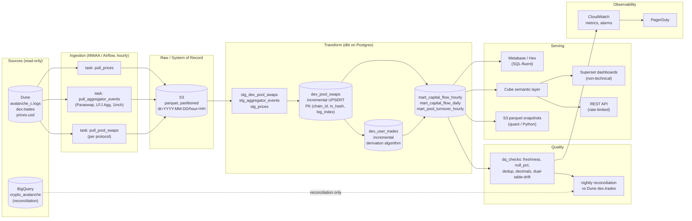

# Batch Pipeline Architecture

## Component cheat sheet

| Component | Why |
|---|---|
| **S3 (parquet)** | System of record. Every warehouse row is rewindable. |
| **Airflow / MWAA** | Orchestrator. AWS-managed to avoid the self-hosted-Airflow ops trap. |
| **dbt** | Transformations. Idempotent, version-controlled, testable. |
| **Postgres (RDS Multi-AZ)** | Single substrate for OLTP serving + analytical marts at current volume. |
| **Cube** | Semantic layer enforces the "never sum across two tables" rule at the API. |
| **CloudWatch + PagerDuty** | Alerting. |

## Cadence

- Hourly ingest, hourly transform, hourly DQ. Each task ~5–15 min.
- Nightly reconciliation at 02:00 UTC. Overwrites last 48h from Dune ground truth.
- Backfills run against a read replica with throttled concurrency.
