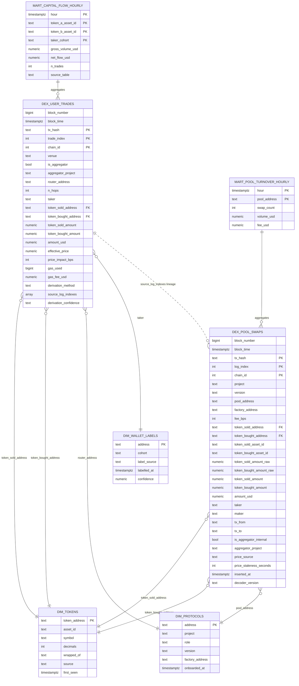

# Data Model — ERD

## The lineage edge that matters

`dex_user_trades.source_log_indexes` is an array linking back to the pool-swap log indexes that constructed it. Reviewers can audit any aggregated row by joining back. This is the "glass box" property: nothing in the aggregation is unreverseable.

## What the marts protect

- `mart_capital_flow_hourly` reads from **`dex_user_trades` only**. Never from pool swaps. This is enforced in dbt.
- `mart_pool_turnover_hourly` reads from **`dex_pool_swaps` only**. Never from user trades. This is enforced in dbt.

The semantic layer (Cube) exposes them as different measures so an analyst cannot mistakenly combine them.
