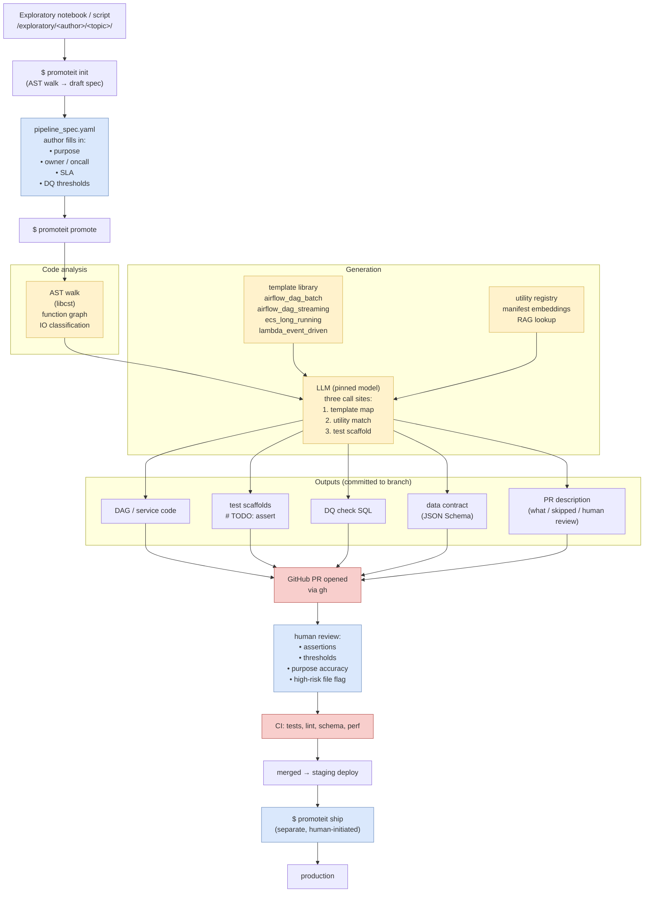

# Part 2 — PromoteIt Workflow Diagram

## Legend

- **Yellow** = AI-driven step
- **Blue** = human-driven step
- **Red** = gate / checkpoint

The shape of the diagram is the design statement: AI does a wide middle band of mechanical work, but every promotion crosses two human gates (the spec, then the PR review) and one technical gate (CI). Promotion to prod is a separate, human-initiated command.
