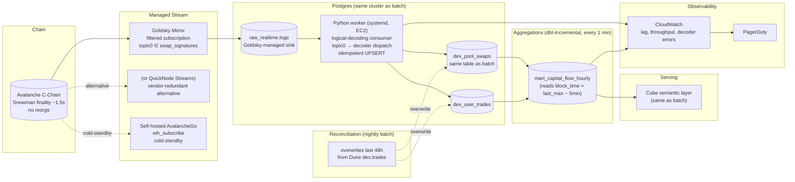

# Real-Time Pipeline Architecture

## Latency budget (end-to-end)

| Hop | Latency |
|---|---|
| Block produced → Goldsky receives | ~1.5 s (Avalanche finality) |
| Goldsky → Postgres raw | < 1 s |
| Python decoder catches up | < 2 s steady state |
| dbt-incremental refresh | 60 s |
| **Total p50** | **~90 s** |
| **Total p95** | **~3 min** |

## Idempotency & finality property

Every row keyed by `(chain_id, tx_hash, log_index)`. UPSERT with `ON CONFLICT DO UPDATE` guarded by `decoder_version` (identical re-writes are no-ops; corrected decoder versions overwrite). Avalanche's deterministic finality means we don't need an N-block confirmation buffer or tombstone-and-rewrite logic. We do still maintain an ingestion-sequence cursor in the worker so at-least-once Goldsky delivery is correctly handled (see Part 1 §4.2).

## What is *not* in the picture (and why)

- **Kafka / Flink / Materialize** — not needed at our volume (hundreds of events/sec at peak). The Python worker + Postgres + dbt-incremental triplet handles current Avalanche DEX volume with comfortable headroom. Decision boundary: switch when sustained event volume crosses ~10k/sec or we need stateful in-flight joins.
- **Separate streaming warehouse** — analytics and operational reads sit on the same Postgres; column-store separation only justified if marts queries exceed 30s at p95.
- **Confirmation buffer** — explicitly *not* present, because Avalanche doesn't need one.
